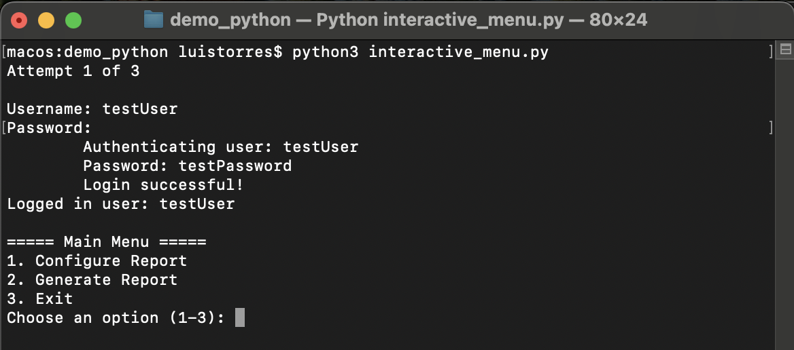
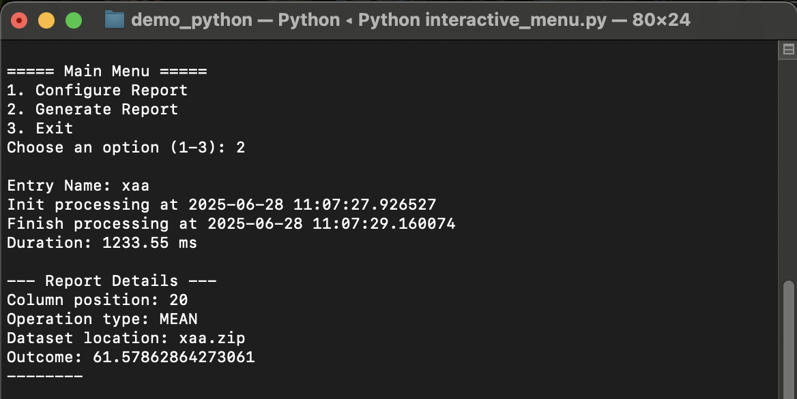
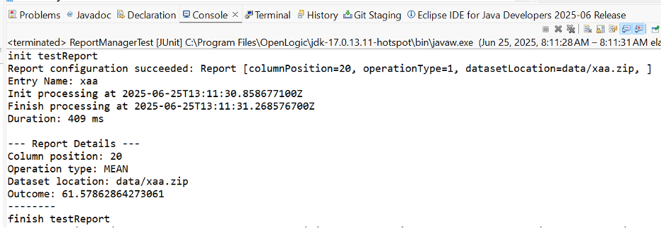
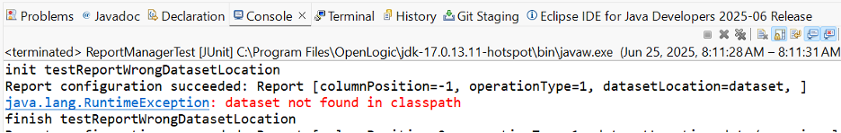
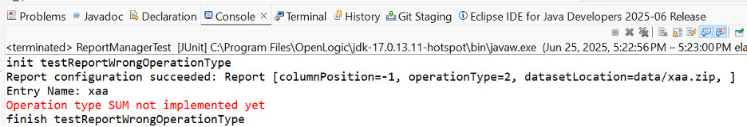
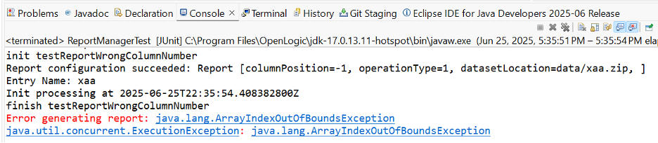
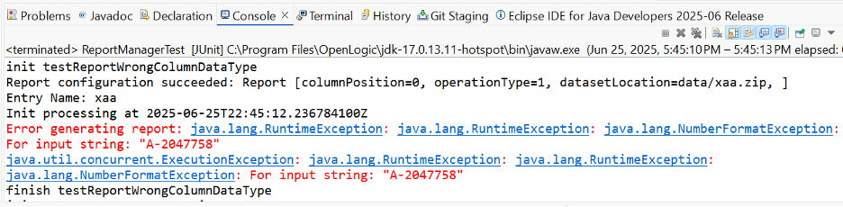

# Assignment part 1
Assignment for the Introduction to Computing course at Essex university. The project has 2 parts: an application written in Java and the other in Python. Both have the same functionality.

## Sample Application features
1. User interface

The user can interact with the application using a terminal

2. Basic authentication

- The application asks for the user's username and password to show the main menu.
- The application stores valid user credentials in memory and returns an error if the provided user credentials are wrong.
- After 3 failed attempts, the application exits.


3.  Data processing
- The application takes a dataset in CSV format and extracts information from it. For instance, it calculates the mean of a specific column. Other types of calculation could have been getting the sum or the minimum/maximum value, but for simplicity, it only calculates the mean. 
- The application expects to process a large dataset. As a result, it uses techniques such as batching and asynchronous processing to increase performance and minimize resources.
- After processing, it shows a report of the processed data.

## Sample Application Technical Design
Class Diagram
Behavioural Diagram
cont. wait for academic license
## Test cases
### Generate Report 

Description: Generate a report about a dataset

Preconditions: The user is correctly authorized to select this option

Steps:
- Select option 1 "Configure Report" and enter valid values for column number, operation type (mean) and dataset location
- Select option 3 "Generate Report"

Expected result:
A report containing the calculated mean of the selected column from the dataset and the time it took to generate.


### Generate report with a wrong dataset location

Description: Generate a report about a dataset

Preconditions: The user is correctly authorized to select this option

Steps:
- Select option 1 "Configure Report" and enter an invalid dataset location. E.g., the file does not exist.
- Select option 3 "Generate Report"

Expected result:
An error message is displayed

 

### Generate report with a wrong operation type

Description: Generate a report about a dataset

Preconditions: The user is correctly authorized to select this option

Steps:
- Select option 1 "Configure Report" and enter an invalid operation type. E.g., operation type SUM is not supported.
- Select option 3 "Generate Report"

Expected result:
An error message is displayed


### Generate report with a wrong column number

Description: Generate a report about a dataset

Preconditions: The user is correctly authorized to select this option

Steps:
- Select option 1 "Configure Report" and enter an invalid column number. E.g., a column number greater than number of columns in dataset
- Select option 3 "Generate Report"

Expected result:
An error message is displayed

 
### Generate report with a wrong column data type

Description: Generate a report about a dataset

Preconditions: The user is correctly authorized to select this option

Steps:
- Select option 1 "Configure Report" and enter a column number containing an invalid data type. E.g., a non numeric data type is not supported
- Select option 3 "Generate Report"

Expected result:
An error message is displayed

 

## Build and run the applications
### Python
### Pre-requisites
- Python 3 or superior 
### Run application 
```
cd demo_python
python interactive_menu.py
```
### Run unit tests
```
python testunits.py
```

### Java
### Pre-requisites
- Java 21 or superior 
### Build
```
cd demo-java
```
- On Windows:
```
mvnw.cmd install
```
- On other systems:
```
./mvnw install
```
This builds the application and runs unit tests.

## Run
```
./mvnw exec:java -Dexec.mainClass="application.InteractiveMenu" -Djava.security.auth.login.config==src/main/resources/sample_jaas.config
```

## Benchmark
The generateReport method of ReportManager class handles a "large" dataset. To efficiently do that, I implemented a simple batch process that reads a file in chunks of manageable size and then process each chunk concurrently. The response time of these processes, considering 10 executions, in Java and Python are:

| Duration (ms) | Java | Python |
|---------------|------|--------|
| 1             | 465  | 1083   |
| 2             | 499  | 1107   |
| 3             | 332  | 1103   |
| 4             | 285  | 1122   |
| 5             | 286  | 1134   |
| 6             | 252  | 1187   |
| 7             | 199  | 1200   |
| 8             | 327  | 1053   |
| 9             | 301  | 1091   |
| 10            | 350  | 1280   |
| **Mean**      | 329.6| 1136   |